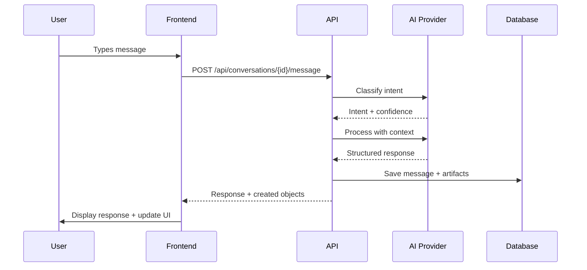
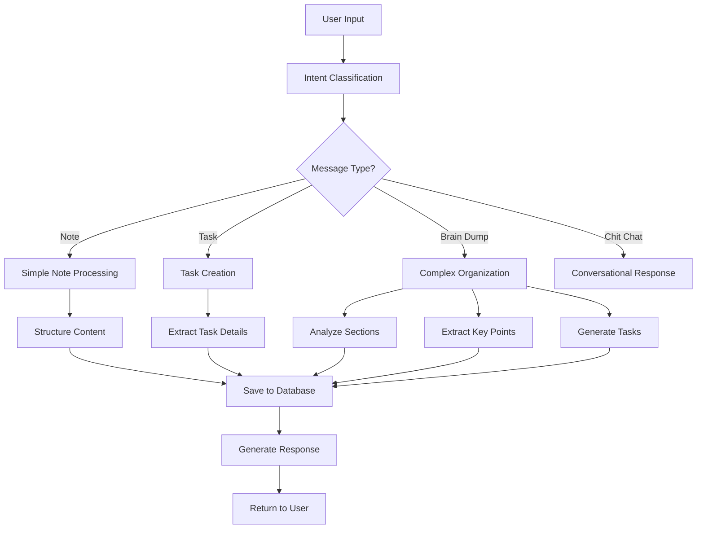

# System Architecture

This document provides a comprehensive overview of the Note-Taker AI system architecture, including components, data flow, and design decisions.

## High-Level Architecture

```
┌─────────────────────────────────────────────────────────────────┐
│                        User Interface                          │
├─────────────────────────────────────────────────────────────────┤
│  Next.js Frontend (React 19, TypeScript, Tailwind CSS)        │
│  • Chat Interface    • Sidebar    • Dashboard    • Thinking UI │
└─────────────────────┬───────────────────────────────────────────┘
                      │ HTTP/WebSocket
┌─────────────────────▼───────────────────────────────────────────┐
│                    API Gateway                                 │
├─────────────────────────────────────────────────────────────────┤
│  FastAPI Backend (Python 3.11+, Pydantic, SQLAlchemy)        │
│  • REST Endpoints   • WebSocket   • Middleware   • Auth        │
└─────────────────────┬───────────────────────────────────────────┘
                      │
        ┌─────────────┼─────────────┐
        │             │             │
┌───────▼──────┐ ┌───▼────┐ ┌──────▼──────┐
│   Database   │ │  AI    │ │   External   │
│ PostgreSQL   │ │Provider│ │  Services    │
│ • Users      │ │Ollama/ │ │ • Calendar   │
│ • Messages   │ │OpenAI  │ │ • Email      │
│ • Notes      │ │        │ │ • Web APIs   │
│ • Tasks      │ │        │ │             │
└──────────────┘ └────────┘ └─────────────┘
```

## Component Overview

### Frontend (Next.js)

**Location**: `src/frontend/`

**Key Components**:
- **Chat Interface**: Real-time conversation UI with message streaming
- **Sidebar**: Notes and tasks management with filtering
- **Dashboard**: Overview of user's productivity data
- **Thinking UI**: Visualization of AI reasoning process

**Technology Stack**:
- Next.js 15 with App Router
- React 19 with TypeScript
- Tailwind CSS for styling
- React Query for state management
- Axios for HTTP requests

**Key Features**:
- Optimistic UI updates
- Real-time message streaming
- Responsive design
- Error handling and retry logic

### Backend (FastAPI)

**Location**: `src/api/`

**Core Services**:
- **Orchestrator Service**: Main AI coordination and intent classification
- **Notes Service**: Note creation, organization, and management
- **Tasks Service**: Task lifecycle and status management
- **Memory Service**: Short and long-term memory management

**API Structure**:
```
/api/
├── conversations/     # Conversation management
├── messages/         # Message handling
├── notes/           # Note CRUD operations
├── tasks/           # Task management
├── health/          # System health checks
└── classification/  # Intent classification
```

**Key Features**:
- Async/await throughout
- Pydantic validation
- SQLAlchemy ORM
- Rate limiting and middleware
- Comprehensive error handling

### Database (PostgreSQL)

**Schema Design**:

```sql
-- Core entities
users (id, email, created_at)
conversations (id, user_id, title, created_at)
messages (id, conversation_id, role, content, created_at)
notes (id, user_id, conversation_id, title, body, tags, created_at)
tasks (id, user_id, conversation_id, title, description, status, due_at, created_at)
categories (id, name, color, user_id)

-- Supporting tables
tool_runs (id, conversation_id, tool_name, input_json, output_json, status)
audit_logs (id, user_id, action, entity_type, entity_id, metadata_json)
```

**Key Design Decisions**:
- Normalized schema for data integrity
- Foreign key constraints for referential integrity
- Indexes on frequently queried columns
- JSON columns for flexible metadata storage

### AI Integration

**LLM Providers**:
- **Ollama**: Local models (llama3.2:3b, llama3.2:1b)
- **OpenAI**: Cloud-based models (GPT-4, GPT-3.5)

**AI Workflow**:
1. **Intent Classification**: Determine if input is note, task, brain dump, or chit-chat
2. **Context Retrieval**: Gather relevant conversation history
3. **Processing**: Structure and organize the input
4. **Response Generation**: Create appropriate response and artifacts
5. **Persistence**: Save created notes and tasks

## Data Flow

### Message Processing Flow



### Thinking Process Flow



## Design Patterns

### Adapter Pattern
Used for LLM providers to allow easy switching between different AI services:

```python
class LLMProvider(ABC):
    @abstractmethod
    async def classify_intent(self, message: str) -> IntentClassification:
        pass
    
    @abstractmethod
    async def process_message(self, message: str, context: List[Message]) -> ProcessingResult:
        pass

class OllamaProvider(LLMProvider):
    # Implementation for Ollama
    
class OpenAIProvider(LLMProvider):
    # Implementation for OpenAI
```

### Repository Pattern
Used for data access to abstract database operations:

```python
class ConversationRepository:
    def create(self, conversation: ConversationCreate) -> Conversation:
        pass
    
    def get_by_id(self, conversation_id: int) -> Conversation:
        pass
    
    def get_messages(self, conversation_id: int) -> List[Message]:
        pass
```

### Service Layer Pattern
Business logic is separated into service classes:

```python
class OrchestratorService:
    def __init__(self, llm_provider: LLMProvider, notes_service: NotesService):
        self.llm_provider = llm_provider
        self.notes_service = notes_service
    
    async def process_message(self, message: str, conversation_id: int) -> ProcessingResult:
        # Orchestrate the entire message processing flow
        pass
```

## Security Architecture

### Data Protection
- **Encryption at Rest**: Database encryption enabled
- **Encryption in Transit**: TLS for all communications
- **PII Redaction**: Automatic removal of sensitive data before AI processing

### Access Control
- **User Isolation**: All data scoped to user_id
- **Rate Limiting**: Per-user request limits
- **Input Validation**: Comprehensive validation of all inputs

### Audit Trail
- **Action Logging**: All user actions logged
- **Data Changes**: Track all modifications
- **Security Events**: Monitor for suspicious activity

## Performance Considerations

### Caching Strategy
- **Database Query Caching**: Frequently accessed data cached
- **AI Response Caching**: Similar queries cached
- **Static Asset Caching**: Frontend assets cached

### Database Optimization
- **Indexes**: Strategic indexing on query patterns
- **Connection Pooling**: Efficient database connections
- **Query Optimization**: Optimized SQL queries

### AI Performance
- **Model Selection**: Balance between accuracy and speed
- **Context Window Management**: Efficient context handling
- **Batch Processing**: Group similar operations

## Scalability Design

### Horizontal Scaling
- **Stateless Services**: Services can be replicated
- **Load Balancing**: Distribute requests across instances
- **Database Sharding**: Partition data by user_id

### Vertical Scaling
- **Resource Monitoring**: Track CPU, memory, and storage usage
- **Auto-scaling**: Automatic resource adjustment
- **Performance Profiling**: Identify bottlenecks

## Monitoring and Observability

### Logging
- **Structured Logging**: JSON-formatted logs with correlation IDs
- **Log Levels**: Appropriate logging levels for different environments
- **Log Aggregation**: Centralized log collection and analysis

### Metrics
- **Application Metrics**: Request rates, response times, error rates
- **Business Metrics**: Notes created, tasks completed, user engagement
- **Infrastructure Metrics**: CPU, memory, disk, network usage

### Tracing
- **Distributed Tracing**: Track requests across services
- **Performance Tracing**: Identify slow operations
- **Error Tracing**: Detailed error context and stack traces

## Future Architecture Considerations

### Phase 2 Enhancements
- **Vector Database**: Add semantic search capabilities
- **Memory Service**: Implement long-term memory
- **Dashboard API**: Enhanced analytics and insights

### Phase 3 Multi-Agent System
- **Agent Architecture**: Specialized agents for different domains
- **Agent Communication**: A2A protocol implementation
- **Tool Integration**: MCP-based external tool integration

### Microservices Evolution
- **Service Decomposition**: Split monolith into focused services
- **Event-Driven Architecture**: Asynchronous communication
- **API Gateway**: Centralized API management

## Development Guidelines

### Code Organization
- **Modular Design**: Clear separation of concerns
- **Dependency Injection**: Loose coupling between components
- **Configuration Management**: Environment-based configuration

### Testing Strategy
- **Unit Tests**: Test individual components
- **Integration Tests**: Test component interactions
- **End-to-End Tests**: Test complete user workflows

### Documentation
- **API Documentation**: Auto-generated from code
- **Architecture Decision Records**: Document major decisions
- **Code Comments**: Clear, up-to-date code documentation

---

This architecture provides a solid foundation for the current MVP while being designed to evolve into a more sophisticated multi-agent system in future phases.
